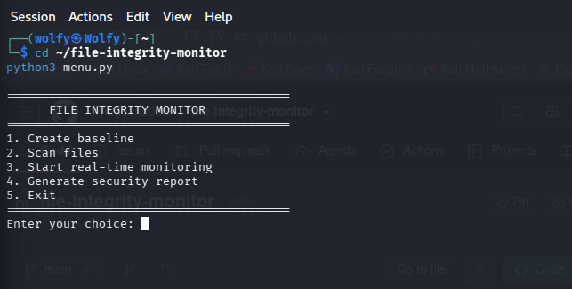
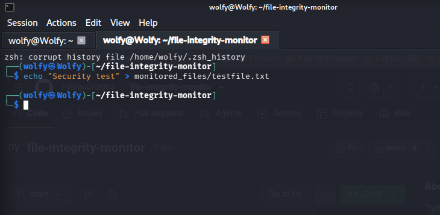
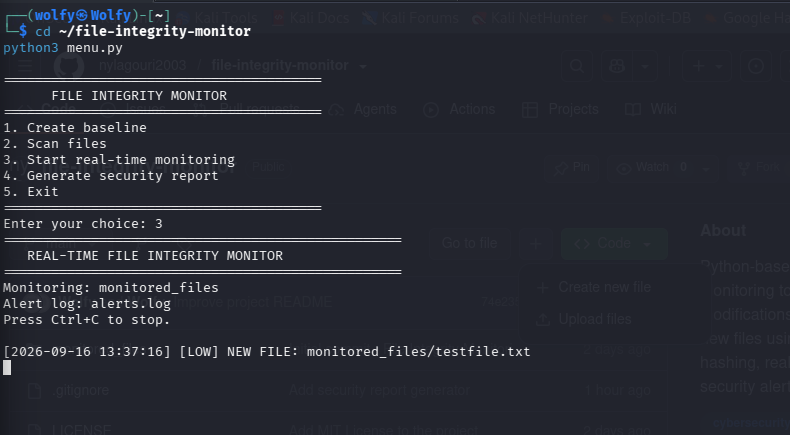

# 🔐 File Integrity Monitoring Tool

A Python-based cybersecurity tool designed to detect unauthorized changes to monitored files using SHA-256 hashing. The project supports baseline creation, integrity scanning, real-time monitoring, severity-based alerts, security logging, and report generation.

## 🎯 Project Overview

File Integrity Monitoring (FIM) is a security technique used to detect unexpected changes to important files.

This project creates a trusted baseline of monitored files and compares future file states against that baseline. It can identify modified, deleted, and newly created files and generate security alerts.

The project was developed as a hands-on cybersecurity project to practice file integrity monitoring, cryptographic hashing, Linux security, Python scripting, security event detection, and security reporting.

## ✨ Key Features

- 🔐 SHA-256 file hashing
- 📋 Trusted baseline creation
- 🔎 File integrity scanning
- 👀 Real-time file monitoring
- 🆕 New file detection
- ✏️ Modified file detection
- 🗑️ Deleted file detection
- 🚨 Severity-based alerts: LOW, MEDIUM, HIGH
- 📝 Timestamped security alert logging
- 📊 Security report generation
- 🖥️ Interactive command-line menu
- 🐧 Linux-based security project

## 🛠️ Technologies Used

- Python 3
- SHA-256
- Linux / Kali Linux
- Git
- GitHub
- Command Line Interface (CLI)

## 🏗️ How It Works

    Monitored Files
           |
           v
    SHA-256 Hashing
           |
           v
    Trusted Baseline
           |
           v
    Integrity Check
           |
      +----+----+----+
      |    |    |
      v    v    v
   Modified New  Deleted
      |    |    |
      +----+----+
           |
           v
    Security Alert
           |
      +----+----+
      |         |
      v         v
  alerts.log  Security Report

## 🖥️ Interactive Menu

Start the tool with:

    python3 menu.py

The menu provides:

    1. Create baseline
    2. Scan files
    3. Start real-time monitoring
    4. Generate security report
    5. Exit

## 📁 Project Structure

    file-integrity-monitor/
    ├── fim.py
    ├── realtime_monitor.py
    ├── generate_report.py
    ├── menu.py
    ├── README.md
    ├── REAL_TIME_MONITORING.md
    ├── LICENSE
    ├── .gitignore
    └── monitored_files/
        └── config.txt

### File Descriptions

| File | Purpose |
|------|---------|
| `fim.py` | Creates the baseline and performs file integrity scans |
| `realtime_monitor.py` | Continuously monitors files for changes |
| `generate_report.py` | Generates a security report from recorded alerts |
| `menu.py` | Provides an interactive interface for the main functions |
| `REAL_TIME_MONITORING.md` | Documentation for real-time monitoring |
| `alerts.log` | Stores timestamped security alerts |
| `security_report.txt` | Generated security report |
| `monitored_files/` | Directory containing files selected for monitoring |

## ⚙️ Installation

### 1. Clone the Repository

    git clone https://github.com/nylagouri2003/file-integrity-monitor.git

### 2. Enter the Project Directory

    cd file-integrity-monitor

### 3. Check Python Installation

    python3 --version

No external Python packages are required for the core functionality.

## 🚀 Usage

### Interactive Menu

    python3 menu.py

### Create a Baseline

    python3 fim.py --baseline

### Run an Integrity Scan

    python3 fim.py --scan

### Start Real-Time Monitoring

    python3 realtime_monitor.py

### Generate a Security Report

    python3 generate_report.py

## 🧪 Testing

The project can be tested by creating, modifying, and deleting files inside the monitored directory.

### Test New File Detection

    echo "Test file" > monitored_files/testfile.txt

Expected alert:

    [LOW] NEW FILE: monitored_files/testfile.txt

### Test File Modification Detection

    echo "Modified content" >> monitored_files/config.txt

Expected alert:

    [MEDIUM] FILE MODIFIED: monitored_files/config.txt

### Test File Deletion Detection

    rm monitored_files/testfile.txt

Expected alert:

    [HIGH] FILE DELETED: monitored_files/testfile.txt

> Note: Perform testing only on files you are authorized to monitor.

## 🚨 Alert Severity Levels

| Severity | Event |
|----------|-------|
| LOW | New file detected |
| MEDIUM | Existing file modified |
| HIGH | Existing file deleted |

## 📊 Security Alerts and Reports

Detected security events are recorded in `alerts.log`.

View the alert log with:

    cat alerts.log

Generate a security report with:

    python3 generate_report.py

The generated report contains:

- Report generation timestamp
- Total number of alerts
- LOW alerts
- MEDIUM alerts
- HIGH alerts
- Recorded security events

The generated `security_report.txt` file is excluded from Git using `.gitignore`.

## 🔒 Security Considerations

This project is intended for educational and authorized security monitoring purposes.

The tool should only be used on files and systems that you own or have permission to monitor.

SHA-256 is used to create file hashes that can be compared to detect changes in file contents.

## 📸 Screenshots

### 🖥️ Interactive Menu

### 🔎 Integrity Scan

### 🚨 Real-Time Alert

### 📊 Generate Security Report

### 📄 Security Report

## 🎓 Skills Demonstrated

- File Integrity Monitoring (FIM)
- Cryptographic hashing
- SHA-256
- Security event detection
- Real-time monitoring
- Security alert classification
- Security logging
- Report generation
- Python scripting
- Linux command-line tools
- Git and GitHub
- Basic security automation
- Technical documentation

## 🎯 Project Goals

- Understand how File Integrity Monitoring works
- Practice cryptographic hashing with SHA-256
- Detect unauthorized file changes
- Implement real-time security monitoring
- Generate and analyze security alerts
- Practice Python-based security automation
- Develop a practical cybersecurity portfolio project

## 👩‍💻 Author

**Nyla S**

Cybersecurity learner interested in security monitoring, ethical hacking, defensive security, and cybersecurity tools.

### Connect With Me

- GitHub: https://github.com/nylagouri2003
- LinkedIn: https://www.linkedin.com/in/nyla-s
- Email: nylas896@gmail.com

## 📄 License

This project is licensed under the MIT License.

Copyright © 2026 Nyla S. All rights reserved.
